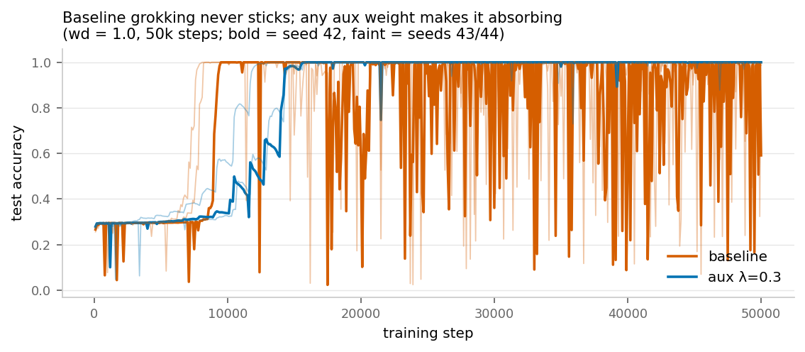
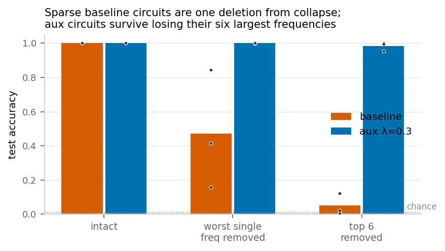
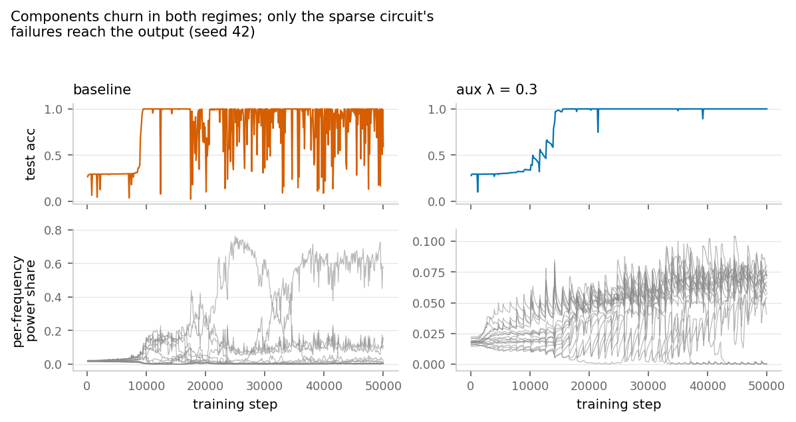
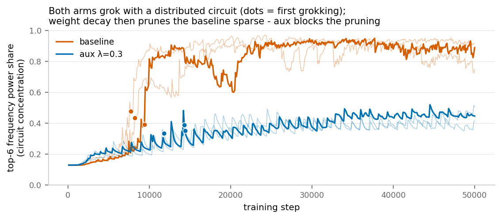
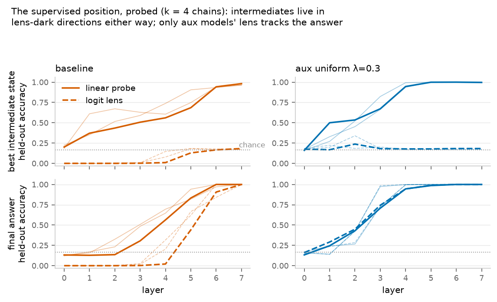
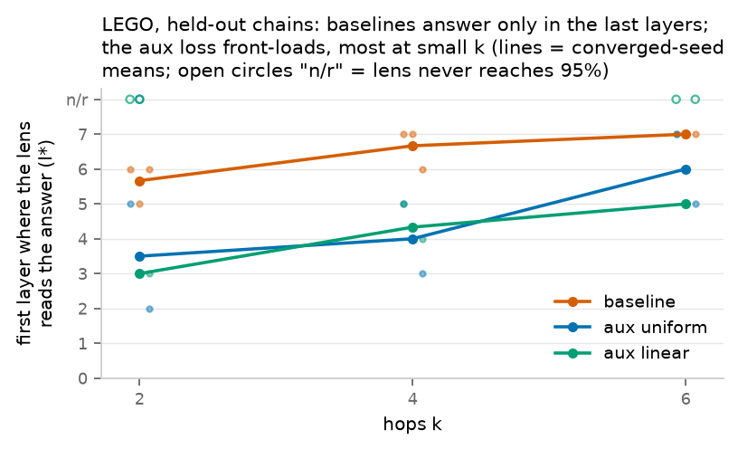
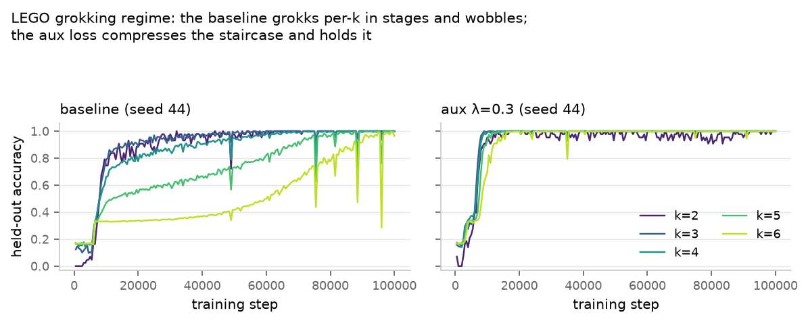
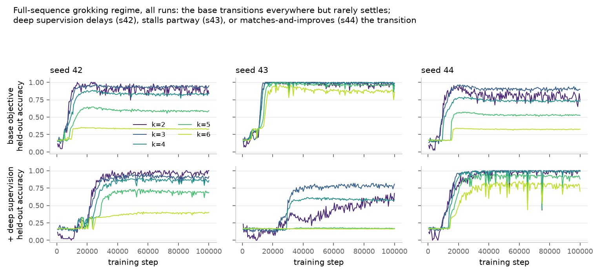

# Grokking doesn't stick: deep supervision reveals — and counteracts — the instability of grokked circuits

*Technical writeup. ~184 runs, all load-bearing results multi-seed. Full per-seed tables and exact commands in [RESULTS.md](RESULTS.md); pre-registered predictions in [EXPERIMENT_PLAN.md](EXPERIMENT_PLAN.md); training curves in the [public wandb project](https://wandb.ai/brendanlong-com/grok-lens); checkpoints on the [HF dataset](https://huggingface.co/datasets/brendanlong/lens-loss-grokking-experiment).*

## TL;DR

*Grokking*: on small algorithmic tasks, a network memorizes the training set almost immediately, sits at chance on held-out data for thousands of steps, then abruptly generalizes (Power et al. 2022). The canonical setup — modular addition with high weight decay — is a workhorse of mechanistic interpretability because the generalizing circuit is fully mapped (Nanda et al. 2023).

We added a **deep-supervision auxiliary loss** to this setup: every layer's residual stream is trained, through the model's own unembedding, to predict the known answer — the logit lens turned into a (supervised) training objective, as in LayerSkip/CALM. We predicted it would break grokking while making the logit lens artificially legible. What actually happened:

1. **The standard grokking metric hides the main phenomenon.** "Grok step = first threshold crossing" credits a state the model doesn't hold. Measured with stability-aware metrics, **baseline grokking in our setup is unstable**: models generalize, fall out of it, and regain it, hundreds of times over a 500k-step horizon with no stable suffix. A no-LayerNorm control pins the scope: **the instability requires LayerNorm** (which we keep for the logit lens; Nanda et al. remove it). LN-free baselines train stably despite ending with *sparser*, equally knockout-brittle circuits — consistent with the known LN×wd effective-learning-rate dynamics (wd shrinks the norms of scale-invariant weights, so the effective LR ratchets up post-grok, where near-zero gradients leave nothing to oppose the decay; van Laarhoven 2017, Li & Arora 2020, Lobacheva et al. 2021). This is also the clean explanation for why the literature never reported the sawtooth: the canonical interpretability model is LN-free.
2. **The aux loss delays first grokking (~2× on average) but makes it stick** — on the depth-1-sufficient arithmetic tasks. The delay is a real cost in one regime — if you monitor and stop training at first grokking — and a large benefit in every other. (On a depth-requiring task the delay reverses into an acceleration; point 6.)
3. **The mechanism is redundancy, not calm — and it takes two ingredients.** Baselines end with the known sparse ~5-frequency circuit, which is one component-failure away from collapse; aux models keep the computation spread over ~18 frequencies. Component-level tracking shows substantial breakage in both — the aux models just have enough backups that in three seeds' worth of tracked training, *not one* of 159 component failures reached the output. The no-LN control completes the picture: instability = LN+wd churn (the perturbation) × a sparse circuit (the fragility). The aux loss removes the fragility; removing LN removes the perturbation; either alone suffices for stability, so ablation-brittleness is necessary but not sufficient for training-time instability.
4. **The sparse circuit — and its fragility — is a *post-grok product of weight decay*, not what grokking finds.** Both arms reach first grokking with the same moderately distributed circuit (top-6 power share ≈ 0.4); weight decay's post-grok "cleanup" then prunes the baseline to the brittle sparse form (→ 0.75–0.91) while the aux loss holds concentration fixed (0.41–0.50). The aux loss doesn't build the redundancy — it *prevents the pruning* of what grokking naturally built. Consistent with this, switching it off lets wd prune the redundancy away (instability returns, 3/3 seeds), and switching it on late rebuilds redundancy only slowly — with stability tracking exactly how much gets rebuilt.
5. **The effect is specific to answer-shaped supervision, and general across tasks.** Reduced weight decay cannot reproduce it (it slows generalization and pruning *together*; the aux loss decouples them), and matched-form supervision against shuffled labels is actively destructive. The full story — instability, post-grok pruning, causal brittleness, aux stabilization with arrested pruning — replicates on a second task (modular subtraction, non-commutative, 3 seeds per arm), with a larger first-arrival cost on the harder task (3.2–4.7× vs ~2×).

Effect strength is not the knob: λ from 0.01 to 3.0 (a 1%-weight loss to a 300% one) produces the same delay, the same distributed circuit, and the same stability. Presence, not strength.

6. **The first-grokking delay is a depth-1 artifact; the stabilization is not.** Both arithmetic tasks are solvable by a single layer, so there the supervision's stable solution is the shallow one and the ~2× delay could in principle be the cost of finding it. On the multi-hop composition task in a grokking regime — where the model provably cannot collapse the computation into one block — the sign flips: the task grokks *per hop-count in stages* (k = 2 first, k = 6 last), the baseline staircase is slow, seed-erratic (k = 6 first crossing 16.5k / 90.5k / never within 100k) and unstable in the familiar sawtooth way, while the aux loss **compresses the entire staircase ~6× (all stages done by 13.5–18.5k steps), makes its timing tight across seeds, and still ends near-absorbing** — with no capability cost on any stratum. Delay-and-stabilize on shallow tasks; accelerate-and-stabilize when depth is required — for *answer-shaped* supervision.
7. **The realistic form of the supervision is the destructive one.** Everything above supervises the answer position against the true answer — supervision and task aligned. Train instead the way a real LM is trained — next-token loss at *every* position, deep supervision included — and every benefit inverts on this task: the full-sequence base objective alone halves attainable held-out accuracy at matched budget and turns the grokking staircase into a violent sawtooth (up to 154 post-crossing collapses at one stratum); adding full-sequence deep supervision on top delays memorization up to ~3.4×, delays or outright prevents most grokking stages (one seed never crosses anything), stabilizes nothing, and in the data-rich regime reduces the model to chance while making every layer's lens *perfectly legible* — structural tokens read at 1.00 from layer 0 and the answer distribution sits at exactly ln 6 entropy through the whole depth. Legibility without competence. Even the answer-shaped aux turns harmful when stacked on the realistic base objective. And the lens/probe grid gives the mechanism-level statement that unifies all of it, on this task: intermediate chain states are linearly present wherever the model computes them, but visible to the lens *only* when the training objective put them into the unembedding basis — the answer-only baseline's lens shows the intermediate staircase; the moment those positions get next-token targets, the staircase vanishes from the lens (in base and aux arms alike, including models that solve those strata) while probes still recover it. **The logit lens shows what the objective trained into the readout — nothing more; probes see what is linearly present.**

A complementary probe result at the supervised position sharpens the same point: intermediate states live in *lens-invisible directions* of the residual (probes recover them where the lens reads chance — in both arms), and what answer-shaped supervision changes is that the lens becomes a faithful readout of the *answer* the moment it is linearly present, where the baseline lens lags the residual by ~2 layers.

## Setup

**Task and training.** a + b (mod 113): all 12,769 ordered pairs, 30% train split, sequences `[a, b, =]`, answer read at `=`. Full-batch AdamW (lr 1e-3, β = (0.9, 0.98), weight decay 1.0, no clipping), 1–3-layer pre-LN transformers (d = 128, 4 heads, ReLU MLP), matching Nanda et al. (2023) except two deliberate deviations that both turn out to matter: depth (their canonical model is 1-layer; intermediate-layer supervision needs ≥ 2) and **LayerNorm** (they remove it for circuit analysis; we keep it because `ln_f` is what makes the logit lens the model's own readout — and it turns out to be the instability's enabling ingredient; a `--no-layernorm` control isolates this below).

**Aux loss.** At each non-final layer ℓ, project the answer-position residual through the final LayerNorm and the shared unembedding — exactly the logit lens — and add cross-entropy against the true answer: total = CE(final) + λ · Σ_ℓ w_ℓ · CE_ℓ, with w_ℓ either uniform (1/(L−1)) or later-weighted ("linear": w_ℓ ∝ ℓ+1, normalized; CALM's schedule).

**Metrics.** *First crossing*: first eval (100-step cadence) with test accuracy ≥ 0.95. *Dips*: post-first-crossing evals with accuracy < 0.90. *Occupancy*: fraction of post-first-crossing evals ≥ 0.95. (Two thresholds are used so occupancy isn't inflated by borderline evals; conclusions are unchanged at a single threshold — sensitivity note in RESULTS.) *Stable crossing*: first crossing after which accuracy never drops below 0.95 again — right-censored by the budget, so reported only with that caveat.

**Arms.** λ ∈ {0, 0.01, 0.1, 0.3, 1, 3} at 2 layers; a 1-layer control; a 3-layer uniform-vs-linear contrast (10 seeds); 50k-step baseline extensions; a Muon arm (hybrid, standard usage: `torch.optim.Muon` for 2-D block weights with decoupled wd = 0.05 matching AdamW's per-step shrinkage, AdamW for embeddings/norms); a no-LayerNorm control (Nanda's architecture, 3 seeds); a 500k-step long-horizon pair; wd = 0 controls; per-frequency knockouts on every checkpoint; per-frequency power traces through training; and objective-switching continuations from trained checkpoints. 3 seeds per cell unless noted.

## Results

*Figure 1 — the phenomenon. Baseline runs (vermillion) touch full test accuracy early and then collapse below 90% dozens of times, indefinitely; aux runs (blue) arrive later and never leave. Bold = seed 42, faint = seeds 43/44; all wd = 1.0, 50k steps.*

### Baseline grokking is unstable; first-crossing metrics hide it

Extended to a 50k-step budget, every AdamW baseline at 2–3 layers shows chronic post-grok collapse: 33–39 (L2) and 41–55 (L3) separate drops below 90% test accuracy, occupancy 0.86–0.90, with the apparent "stable point" always pinned to the end of whatever budget is used (pure censoring — at 30k it appears at ~29k, at 50k at ~49k). **The sawtooth is not a short-budget artifact: at 500k steps the baseline is still collapsing** (270 dips at full eval resolution, occupancy 0.93, no suffix of the run stable — dipping to the end of half a million steps). The same instability holds for Muon at 2 layers (39–48 collapses); the **Muon 3-layer baseline is the exception** — only 7–17 dips, occupancy 0.95–0.98 — so within LN architectures the scope is *AdamW at 2–3 layers and Muon at 2 layers*. These unstable models are still grokking models: they generalize, lose it, and regain it, repeatedly.

**The instability requires LayerNorm.** Running the L2 AdamW baseline with Nanda's LN-free architecture (`--no-layernorm`, 3 seeds) flips the phenotype completely: 1–4 dips, occupancy 0.99 — near-absorbing, like the aux runs — while ending even *sparser* than the LN baselines (top-6 power share 0.95–0.97 vs ~0.9) and just as causally brittle (worst single-frequency knockout → 0.10–0.23 accuracy; top-6 → chance). This matches the scale-invariance literature: for LN-invariant weights, wd cannot regularize the function, only shrink norms, which raises the effective learning rate (∝ lr/‖w‖²); post-grok, gradients are near zero, nothing opposes the decay, and the effective LR ratchets until the solution destabilizes — the periodic-destabilization regime described for BN+wd by Lobacheva et al. (2021), transplanted to LN at wd = 1.0 (one to two orders of magnitude above typical). Caveat: pre-LN transformers are only approximately scale-invariant, so this is a strong qualitative match rather than an exact account.

Why did nobody notice? Three compounding reasons: metric (first-crossing under-reports), budget censoring, and — decisively — architecture: **Nanda et al.'s canonical model has no LayerNorm**, and LN-free baselines don't sawtooth. Their 1-layer choice compounds it: our 1-layer control (LN kept) groks very late (13.2k / 19.5k / 27.1k across seeds) and then holds (0–1 dips; single-seed at 50k).

Weight decay appears to be the driver on both sides of the ledger. At wd = 0, nothing groks at all — 0/6 runs in 50k steps, with or without the aux loss (which lifts the test plateau from ~0.20 to ~0.29, 3/3 seeds, but produces no transition): wd is the generalization driver, and the aux loss cannot substitute for it. And the continuation experiments below show wd actively eroding circuit redundancy when nothing opposes it. We could not measure post-grok stability at wd = 0 (nothing groks there), and slingshot oscillations are known to involve adaptive-optimizer dynamics generally (Thilak et al. 2022), so we scope the attribution as wd-plus-adaptive-optimizer.

### The aux loss: later first grokking, then (nearly) absorbing

| L2 AdamW cell | first crossing (per seed) | dips <0.90 | occupancy |
|---|---|---|---|
| baseline (50k budget) | 7.6k / 7.8k / 7.9k | 33–39 | 0.89–0.90 |
| λ = 0.01 | 14.7k / 16.9k / 20.4k | 0–3 | 0.98–0.99 |
| λ = 0.1 | 11.2k / 13.4k / 14.4k | 0–3 | 0.98–1.00 |
| λ = 0.3 | 11.5k / 13.7k / 19.4k | 0–3 | 0.98–0.99 |
| λ = 1.0 | 15.3k / 16.2k / 19.3k | 0–3 | 0.98–1.00 |
| λ = 3.0 (50k budget) | 16.2k / 20.3k / 27.2k | 0–3 | 0.98–0.99 |

(Dip counts are the verified across-cells range; per-cell tabulation in the analysis-script output.) Memorization is never affected (train accuracy ~100% by step 100–200 in every run in the study); full generalization is never prevented; the first-arrival delay is flat in λ across 2.5 orders of magnitude. The contrast extrapolates to a 10× horizon: at 500k steps the λ = 0.3 run has 13 dips to the baseline's 270 — per-50k rates of ~1.3 vs ~27, matching the 50k cells — with occupancy 0.996 vs 0.930. The aux run is near-absorbing rather than absorbing: it dips rarely but indefinitely (its last dip is at ~459k), while the baseline never approaches stability.

At 3 layers with 10 seeds, the baseline first-crosses at 3.1–3.7k with a mean of 22.4 collapses per 30k run (occupancy 0.90), while **uniform** aux delays first crossing to 5.1–16.4k with 0–2 dips (mean 0.7) and **linear** to 3.8–20.9k with **0–10** dips (mean 2.8). The linear arm's three high-dip seeds (10/6/7) are not noise — they are exactly the three aux runs whose circuits stayed sparse, and they carry the mechanism section below. The uniform-vs-linear first-arrival contrast itself is directional but marginal (uniform later on 8/10 seeds, sign test p = 0.055).

Under Muon, first grokking is ~2× faster for everyone at 2 layers (baseline 3.3–3.5k; replicating Tveit et al. 2025), the aux first-arrival delay reproduces (8.2–9.9k), and the L2 stabilization reproduces sharply (3–5 dips vs 39–48). At Muon-L3, aux gives no stability benefit (11–15 dips vs the baseline's 7–17) — the one standing exception, discussed below.

### Mechanism: redundant circuits under constant fire

**Sparse vs distributed (FFT).** AdamW baselines concentrate 92–97% of embedding Fourier power in ~5 frequencies — the known circuit. Every uniform-weighted aux model spreads 90% of power over 16–20 of 56 frequencies, identically from λ = 0.01 to 3.0.

*Figure 2 — causal brittleness. Bars are 3-seed means (dots = seeds): deleting the single worst frequency halves baseline accuracy on average; deleting the top six sends baselines to chance while aux models retain ~98%.*

**Brittleness is causal (knockout).** Projecting a *single* top frequency out of a baseline's embedding costs up to 90 points of test accuracy; removing its top six sends every AdamW baseline to chance. Removing the top six from an aux model leaves 83–100% accuracy — under both optimizers. This is not an artifact of "six" meaning different things per arm: at a *power-matched* ablation (removing top frequencies until 60% of embedding power is gone from each), aux models retain ~0.55 accuracy vs the baselines' ~0.12; at 90% removed both arms die — the distributed circuit is *wider and gracefully degrading*, not unkillable, which is the precise sense in which we use "redundant" (what is strictly shown is *distributed and knockout-robust*; whether it contains literal backup subcircuits or one widened algorithm is open). *Functional redundancy* (accuracy after top-6 removal) turns out to be the right circuit metric: raw spectral spread misleads (Muon baselines look diffuse in power but are functionally top-6 circuits — and at L2 they slingshot accordingly). Within AdamW, functional redundancy predicts post-grok stability across all 20 aux runs with no exceptions — including the three linear-arm seeds that kept sparse circuits despite the aux loss and were exactly the three unstable aux runs. And critically, the metric was then tested *out of sample*: in the rescue continuations (below), it predicted post-switch stability in a context it was not selected on. The correlation is clean *within AdamW only*: the Muon-L3 pair (functionally concentrated baseline that is fairly stable; fully redundant aux arm that is mildly unstable) shows Muon contributes optimizer-specific dynamics on both arms — the continuation experiments, which hold the optimizer fixed and flip only the objective, are what isolate the circuit's causal role from optimizer dynamics.

The no-LN control adds the complementary scoping: brittleness is *necessary but not sufficient* for instability. LN-free baselines are the sparsest, most knockout-brittle models in the study and train near-absorbingly anyway, because without LN the wd-driven effective-LR ratchet — the perturbation source — is gone. The two-ingredient story (LN+wd churn × sparse circuit) is what the rest of this section fills in: redundancy predicts stability *given* the churn, and the churn traces below show the perturbations arriving in both arms of the LN setup.

*Figure 3 — churn without consequence. Per-frequency power shares (bottom; note the different y-scales — the aux model has no dominant components, max share ~0.1 vs ~0.7) churn in both regimes, but only the baseline's component failures appear in test accuracy (top).*

**Components break constantly either way** *(instrumented, 3 seeds)*. Logging per-frequency power at every eval: component collapse events (an active frequency losing >50% of its power between evals) occur throughout post-grok training in both regimes — baselines 55–76 events per run, aux runs 13–92 (rates vary widely by seed). The robust difference is the coupling to the output: **5–22 collapses per baseline run coincide with an accuracy collapse; 0 of 159 pooled aux collapses do, in every seed.** Consistent with this, aux models' logit margins are quiescent (median test loss ~10⁻⁴ in accuracy-intact evals vs ~10⁻² for baselines *between* their visible collapses). Stability is failure isolation — enough backups that they never all break at once — not the absence of damage.

**Where the sparse circuit comes from (formation traces, 3 seeds).** Tracking circuit concentration through *full* training refutes the natural guess that the dense per-layer gradient steers formation toward accumulating many weak components: **both arms reach first grokking with statistically indistinguishable concentration** (top-6 share at first crossing: baseline 0.39/0.48/0.43 vs aux 0.39/0.33/0.35). The divergence is entirely post-grok: baselines continue to concentrate under weight decay's pruning (→ 0.89/0.75/0.91 by 50k) while aux runs plateau (0.44/0.41/0.50). So grokking naturally discovers a distributed circuit; the celebrated sparse Fourier circuit of the interpretability literature is the product of the post-grok "cleanup" phase (Nanda et al.'s own term) — and that same cleanup is what creates the brittleness and the chronic instability. The aux loss is simply an anti-cleanup brake.

*Figure 4 — the resolution of the mechanism question. Top-6 frequency power share over training; dots mark first grokking. Both arms grok at concentration ≈ 0.4; weight decay then prunes baselines to ≈ 0.9 while the aux loss holds the line.*

**Maintenance and slow rebuilding (objective switching, 3 seeds).** From a stabilized aux checkpoint, continuing with λ = 0 lets weight decay prune the redundancy back to a functionally sparse circuit in every seed (all three aux-off finals collapse to chance on top-6 removal) and the instability returns (27–49 dips vs the same-source aux-on controls' 0–2), with dips *accelerating* as the ensemble erodes. So the aux gradient continuously replaces failing components against wd's pruning. In the reverse direction — λ = 0.3 switched on from a slingshotting baseline — the layer-0 readout aligns within 100 steps, but redundancy rebuilds only slowly and partially, at seed-dependent rates (accuracy-after-top-6-removal reaches just 0.01 / 0.15 / 0.44 in 30k steps, vs 0.83–1.0 for aux-from-scratch) — and **post-switch stability tracks the rebuilt redundancy monotonically** (24 / 4 / 1 dips) — an *out-of-sample* test of the functional-redundancy metric in a context it was not selected on. The baseline-continuation controls are bursty (2–76 dips per 30k window — baseline instability is heavy-tailed), so short-window behavioral comparisons are noisy and the circuit metric is the reliable readout.

### Where the computation goes

On the arithmetic tasks, per-layer answer supervision collapses the computation into the first block. In all 18 two-layer aux runs (every λ, both optimizers), the layer-0 lens alone scores 1.000 on held-out pairs and agrees with the final output; later blocks approach answer-preserving identities as λ grows (cos(r₀, r_final) 0.845 → 0.98). Since the layer-0 lens *is* the truncated model, every aux network — including the 3-layer ones, whose layer-0 lens is also 1.000 (a different, 30-run subset) — can be cut to one block at zero accuracy cost.

This bounds what the arithmetic tasks can say about the pre-registered "dark space" prediction — that supervision would push *necessary* intermediate computation into lens-invisible directions. Modular arithmetic has no necessary intermediates (one layer suffices), so the prediction is not testable there; what these runs show is that when a shallow solution exists, the supervision finds it rather than maintaining a deep solution with hidden structure. The multi-hop task below is where the tension is real: its aux models provably compute intermediates (they solve k ≥ 3), the supervised position's lens below the coalescence layer reads near-uniform rather than intermediate-shaped, and intermediate states are decodable at the *unsupervised* `<op>` positions — the position half of the dark-space prediction.

*Figure 5 — the direction half, tested. Held-out accuracy by layer at the `<predict>` position (k = 4 chains; solid = plain linear probe, dashed = logit lens; bold = seed 42). Top: the best intermediate trajectory state is linearly decodable far above the lens in both arms. Bottom: baselines carry the answer linearly ~2 layers before the lens can read it; in aux models the two curves coincide.*

**The direction half holds too — in both arms.** Fitting plain linear probes (no bias, no normalization; fit on each run's own train chains, evaluated on its held-out split) for every trajectory state on the `<predict>`-position residual: below the coalescence layer, where the lens reads near-chance, the probes recover intermediate states at up to 0.55–0.95 held-out accuracy (lens at the same cells: ≤ 0.34, excluding the overfit 173-chain k = 2 stratum). The supervised position's residual is not answer-subspace-only — it carries the intermediates in lens-invisible directions, and it does so in baselines at least as strongly as in aux models, so this is a property of the task and architecture rather than something the supervision creates. What the supervision *does* change is the answer direction: in baselines the final answer is linearly present well below ℓ\* while the lens cannot yet read it (probe up to 1.00 vs lens 0.62–0.93 — the baseline lens under-reports what the residual knows), whereas in aux models probe and lens agree on the answer at every layer (|gap| ≤ 0.05 across all 18 aux run × k cells). Per-layer answer supervision does not relocate the intermediate computation; it aligns the answer's direction with the unembedding the moment the answer exists, making the lens a faithful readout of exactly the quantity it was trained on and nothing else.

### Specificity: it's the answer-shaping, not generic regularization

Two controls separate "answer-shaped deep supervision" from "any pressure that opposes weight-decay sparsification":

- **Reduced weight decay is not a substitute.** wd = 0.5 baselines still prune to sparse (top-6 → 0.89–0.94) and still slingshot (14–20 dips); wd = 0.25 is stable-so-far only at 3.5× the first-grok cost, with the circuit *still sparsifying* at 50k (0.44 → 0.85 and rising) and a short, censored post-grok tail. Lowering wd slows generalization and pruning **together**; the aux loss uniquely **decouples** them (near-normal grokking speed, permanently arrested pruning).
- **Matched-form non-answer supervision is destructive, not stabilizing.** Supervising intermediate layers against a fixed random permutation of the labels (same functional form and magnitude) blocks generalization outright in 2/3 seeds and produces the least stable run in the entire study in the third (48 dips, occupancy 0.47) — while pinning the layer-0 lens to memorized noise (test lens accuracy 0.01). Despite low spectral concentration (~0.2), there is no stability — one more independent confirmation that *functional answer-circuit* redundancy, not diffuseness, is the operative property.

Answer-shapedness matters twice: generalization survives the supervision only when the targets are true, and the maintained redundancy is redundancy *of the answer circuit*.

### A second task: modular subtraction

Everything above could have been a fact about one circuit. On a − b (mod 113) — non-commutative (which also removes addition's commutative-pair leakage; its pre-grok test accuracy sits at true chance), known to grok more slowly — the complete baseline story replicates 3/3: first grok at 10–12k, chronic instability (33–72 dips, occupancy 0.78–0.90, *worse* than addition), post-grok sparsification (top-6 ≈ 0.5 at grok → 0.92–0.97), and causal knockout brittleness (top-6 removal → chance). The aux phenotype also replicates 3/3, at a higher price on the harder task: first grok at 33k / 52.5k / 58.2k (3.2–4.7× that task's baseline vs addition's ~2×), then near-absorbing (0–3 dips, occupancy 0.99–1.00) with pruning largely arrested (0.40 at grok → 0.56–0.70, vs baselines' 0.92–0.97).

*Figure 6 — front-loading on the multi-hop task, measured on held-out chains. First layer at which the lens reads the final answer, vs hop count (lines = means over converged seeds; open circles = runs whose lens never reaches 95% at that k): baselines answer only in the last layers regardless of difficulty; aux models answer earlier, most strongly at small k.*

**A third task, briefly** *(k-hop non-abelian group composition: S₃ "LEGO" chains, 8-layer models; 3 seeds per arm)*. The data pipeline enumerates all 335,922 chains (k ≤ 6) and holds out a disjoint per-k-stratified test split; training samples chain length uniformly, which is itself a finding — sampled proportionally to the enumeration (83% k = 6, with easy short chains at 0.08%), no run ever lifts off chance, so the short-chain curriculum is *required* for learnability. On held-out chains: baselines generalize fully (100% at k ≥ 2, 3/3 seeds; the k ≤ 1 strata have 1 and 7 test examples and show occasional single-example misses). The aux loss preserves capability at k ≥ 3 (~100%, uniform weighting) but **costs accuracy on short chains**: the single held-out k = 0 identity chain fails in 3/3 uniform seeds, k = 1 drops to 0.43–0.86 (vs baselines' 0.71–1.0), and held-out k = 2 accuracy dips below 0.95 in several aux runs; the linear weighting fully converges in only 1/3 seeds within the matched budget. **The aux loss front-loads the computation**: robustly at k = 4 (uniform-aux coalescence layer ℓ* = 3–5 vs baseline 6–7, all seeds), at k = 6 where the run converges (5–6 vs 7), while at k = 2 the aux short-chain accuracy cost caps lens readability below the 95% criterion at every layer, so those cells have no coalescence layer at all. Below ℓ* the aux lens is a calibrated anytime estimate — near-uniform over answers (entropy ≈ ln 6), sharpening as the answer coalesces — where the baseline lens is confidently wrong (entropy 0.1–0.5 with accuracy 0.0). A full-sequence variant — lens supervision against the *next token at every position* rather than the answer — substantially harms the task at matched budget (train accuracy 0.66–0.72, held-out ≤ 0.33 at k = 6, 2 seeds), consistent with the specificity finding: answer-shaped supervision is the benign form. In this data-rich regime the task is not a grokking task — these runs speak to relocation/front-loading only; the grokking version follows.

### The multi-hop task in a grokking regime: acceleration, not delay

Everything above leaves one exit open: on depth-1-sufficient tasks the aux loss's stable solution is the shallow one, so "delay then stabilize" could be the signature of the supervision steering training into that shallow basin. The multi-hop task closes the exit — solving k = 6 requires genuinely deep computation — once it is placed in a grokking regime: train on a small fixed subset of the enumerated chains (per-k-balanced, since the short-chain curriculum finding still applies), raise weight decay, constant LR, evaluate on the full held-out split.

The regime search (subset size 2k/5k/10k × wd 0.1/0.3/1.0, 50k steps) establishes three things. At 2k chains the model memorizes within ~2k steps and never generalizes (held-out drifts to ~0.3); at 10k chains it memorizes and then generalizes **per hop-count in stages** — k = 2 and k = 3 first, k = 6 last — a staged transition rather than a single grok. And the baseline sawtooth appears on this task exactly as the two-ingredient account predicts for an LN architecture, scaling with the perturbation strength: near-stable at wd 0.1, k = 2 collapsing 10 times at wd 0.3, and chronic degradation at wd 1.0 (34–35 post-crossing collapses per crossed stage, occupancy ~0.5, final accuracy *falling* with continued training).

*Figure 7 — the depth-requiring grokking regime (10k-chain train subset, wd = 0.3, seed 44 shown). The baseline grokks in stages spread over the whole budget, with correlated collapses late in training; the aux model completes the entire staircase within ~15k steps and holds it.*

The head-to-head (10k chains, wd 0.3, 100k steps, 3 seeds per arm) reverses the arithmetic-task delay:

| per-k first crossing | k2 | k3 | k4 | k5 | k6 |
|---|---|---|---|---|---|
| baseline (s42/s43/s44) | 20k/6.5k/23.5k | 37.5k/6.5k/24k | 62k/7.5k/48.5k | 87k/9.5k/74.5k | —/16.5k/90.5k |
| aux λ = 0.3 uniform | 9k/8.5k/10k | 9k/8.5k/8k | 9.5k/11.5k/8.5k | 12k/15.5k/10.5k | 15.5k/18.5k/13.5k |

("—" = never crosses 0.95 within 100k.) Three observations:

- **Acceleration.** The aux loss compresses the full staircase into 8–18.5k steps; the baseline spreads it over 6.5k–90.5k and one seed never completes it. At the hardest stratum the median advantage is ~6× (k = 6: 15.5k vs 90.5k). One baseline seed (s43) happens to grok fast and beats its aux counterpart by a small margin at every stage — the acceleration is a median/2-of-3-seed effect, whose complement is the next observation. The dense per-layer answer gradient, which on shallow tasks slowed first grokking, *helps* when there is a deep staged circuit to build.
- **Timing regularization (3/3 seeds).** Baseline first-crossings are heavy-tailed across seeds (k = 6 spans 16.5k → never); aux crossings sit within a 1.4× band. 
- **Stability, again (3/3 seeds).** Baselines sawtooth in two of three seeds (14–15 post-crossing collapses below 0.90, occupancies down to 0.83; the third seed wobbles below 0.95 chronically instead); aux runs are near-absorbing (≤ 1 dip per stratum, occupancy 0.87–1.00 — the 0.87 is borderline evals on the 43-example k = 2 stratum with zero dips; all other strata sit at 0.95+ — final held-out mean 0.997–1.000, including the short strata that lose accuracy in the data-rich regime).

The one arithmetic-task claim this modifies is the cost side of the ledger: the first-arrival delay is not a property of the aux loss but of the task's depth profile. Where the supervision can only be satisfied by a shallow circuit, it pays a delay to find one; where the task forces depth, the same signal becomes scaffolding — per-layer supervision toward the answer apparently guides each stage of the staircase as it forms — and the model reaches full generalization sooner, more predictably, and more durably than without it.

### The realistic form: full-sequence supervision inverts every benefit

Every arm so far supervises the answer position against the true answer — a setting where the supervised quantity is the only thing graded, so supervision and task cannot conflict. A real language model is trained differently: next-token cross-entropy at every position, and deep supervision (as in LayerSkip) applies the same targets at every layer. On this task most of those targets are irreducible noise — the operands are uniform-random, so no position that predicts one can do better than a calibrated guess — which makes the full-sequence setup the adversarial version of the question: what does per-layer supervision do when most of what it supervises is unlearnable?

Trained this way in the data-rich regime (matched budget, one seed per arm), the base objective alone cuts held-out accuracy roughly in half (0.46–0.79 per stratum vs ~1.00 answer-only), and adding full-sequence deep supervision reduces the model to chance on every stratum — while making every layer maximally lens-legible: structural tokens (`<op>`, `<predict>`) read at 1.00 from layer 0, positions with unpredictable targets sit at calibrated near-uniform, and the answer distribution holds exactly ln 6 entropy through the entire depth. The supervision succeeded completely at its own objective and the task died — legibility without competence. A control isolates how far the damage extends: even the *answer-shaped* aux, benign to beneficial everywhere above, drops the model to chance when stacked on the full-sequence base objective (one seed) — the benignness of deep supervision is contingent on the base objective, not just on its own targets.

*Figure 8 — the same grokking cell as Figure 7 under the realistic objective (seed 44 shown). The full-sequence baseline generalizes partially and never settles; adding full-sequence deep supervision delays every stage and leaves chronic collapse spikes.*

In the grokking regime (same cell as the answer-shaped head-to-head, 3 seeds per arm), the pattern is delay-and-destabilize — the mirror image of the answer-shaped accelerate-and-stabilize in the identical cell. The full-sequence baseline still grokks per-k but only one seed completes the staircase within 100k steps, and the sawtooth becomes violent (69, 122, and 154 collapses at the worst stratum of the three seeds, occupancies as low as 0.01). Full-sequence deep supervision on top delays memorization 1.1–3.4×, delays most measurable first crossings ~1.8–2.8× (one pair, s44 k3, is unchanged within noise) or prevents them entirely (one seed crosses nothing; k = 6 never crosses under the aux loss), and stabilizes nothing.

The position-by-position lens/probe grid ties the capability results to the interpretability claim. In the answer-only baseline, the op-position staircase is *lens-visible* — the lens reads intermediate states at up to 1.00 at the positions that compute them. Under the full-sequence objective the staircase vanishes from the lens everywhere (best intermediate cell ≤ 0.30 over all layers × positions, base and aux arms alike, including models that demonstrably solve those strata) while plain linear probes still recover the intermediates wherever the model computes them (1.00 for the first composition, 0.69–0.80 for the second). Those positions' readout directions now carry their trained targets — the next token — and nothing else. Across all four arms of this task one statement survives: **the logit lens shows exactly what the training objective put into the unembedding basis; linear probes show what is linearly present** (which here tracks what the model computes, up to the partial-decodability caveat below). On this evidence the lens is not a window into the computation — it is a mirror of the loss.

## Discussion

**For grokking research**: report occupancy or stability-aware crossings, not first-crossing — first-crossing time stays decision-relevant only in the monitored-early-stopping regime, where the aux loss's ~2× delay is a genuine cost. Know which side of the LN line your architecture is on: the canonical recipe (wd = 1.0, constant LR, full-batch adaptive optimizer, training far past convergence) sits squarely in the known normalization×wd periodic-instability regime *if* your model keeps its norms — Nanda-style LN-free models don't, 1-layer models barely, and multi-layer LN models sawtooth indefinitely. "Unstable" does not mean "not grokking."

**Speculation, clearly labeled**: if grokking-like phase transitions occur during large-scale training and share this instability, models at scale could be acquiring and losing specific capabilities continuously under ongoing regularization pressure, with aggregate metrics too coarse to show it. The LN finding sharpens where to look: frontier training escapes the *global* ratchet (gradient noise from single-epoch data keeps norms at equilibrium; LR schedules decay; wd is ~0.1), but a mastered rare capability's circuit sees near-zero refresh gradient while wd erodes it continuously — the toy's condition, recreated locally in the data-frequency tail. We have no evidence beyond this toy setting; we flag it because the failure mode — capability churn masked by averaged evals — is structurally the same one first-crossing metrics have on the toy.

**For interpretability**: training a model to be lens-legible changed the object under study — the circuit's location, spectrum, and robustness class all moved. "Train for transparency" proposals should expect the object, not just the view, to move. And the four-way lens/probe grid puts a sharp boundary on what the logit lens shows, at least on this task: it reads out whatever the training objective placed in the unembedding basis and is blind to everything else, however cleanly the model computes it — the same intermediate states flip between fully lens-visible and fully lens-invisible across training objectives while remaining linearly probeable throughout. To the extent this transfers, lens-based evidence about "what a model represents" is evidence about the loss, not the computation.

**For training practice**: a 1%-weight deep-supervision term acted as a strong implicit regularizer toward redundant, failure-isolating solutions — at a first-generalization cost that depends on the task's depth profile (~2× later on tasks a single layer can solve; ~6× *earlier*, with tighter seed-to-seed timing, on the task that requires depth) — and yields free early-exit/truncation structure (LayerSkip's use-case, rediscovered from the science side). But every benefit is conditional on supervising a true, learnable quantity on a compatible base objective: the realistic full-sequence form — the one an actual LayerSkip-style LM uses — was destructive on this task at every level tested. The caveat cuts both ways: this task's non-answer tokens are *irreducibly* random, the worst case for next-token supervision, whereas natural text is largely predictable — so whether LayerSkip-style training at scale lands on the benign or the destructive side of this divide is an open empirical question, now with a concrete axis (how much of the per-layer supervision is unlearnable noise) rather than a vague one.

## Open questions

1. **Why does per-layer answer supervision stop weight decay's cleanup?** The formation traces establish *that* it does — grokking finds the distributed circuit on its own, and the aux loss blocks the post-grok pruning that would concentrate it — but not *how*. Mechanically, the aux gradient must penalize the pruning direction — plausibly because removing a frequency's embedding component transiently degrades the layer-0 readout before the remaining components compensate — but we have not verified this gradient-level account. Also unexplained: the wd = 0 plateau lift (+0.1 accuracy, 3/3). We deliberately did not reverse-engineer the distributed circuit's algorithm — the knockout/churn evidence carries the stability claims without it.
2. The Muon-L3 pair (stability decoupled from circuit redundancy in both directions).
3. Whether the sparse trap is escapable on longer horizons.
4. Why the intermediate trajectory states are only partially linearly decodable (probe accuracy 0.5–0.95, not 1.0) at the supervised position — whether the remainder is nonlinearly encoded there or genuinely lives only at the `<op>` positions.
5. **The mechanism of the acceleration on the depth-requiring task.** The timing data show per-layer answer supervision compresses the staged transition ~6× and tightens its seed-to-seed spread, and the front-loading/coalescence results show *where* the answer becomes readable — but there is no circuit-level account of *how* the dense gradient guides each stage's formation, nor of why baseline stage-timing is so heavy-tailed (16.5k → never for k = 6 across seeds of one configuration).
6. **Why the full-sequence base objective poisons even answer-shaped deep supervision** (single-seed result). The answer-position aux targets are unchanged between the base objectives, yet the arm that thrives on the answer-only base collapses to chance on the full-sequence base — some interaction between the noise-target pressure at the final layer and per-layer answer-shaping, not yet isolated.
7. Where natural-language training falls on the noise axis: this task's non-answer tokens are irreducibly random (the destructive extreme); text is largely predictable. A task family interpolating target predictability would locate the crossover.

## Limitations

The instability itself is a property of *LN architectures* under the canonical recipe — the no-LN control makes this a scope condition, not a footnote: with Nanda's LN-free architecture the baseline is already near-absorbing and the aux loss's stabilization value largely disappears (its circuit-shaping and front-loading effects remain). The stability story spans two modular-arithmetic tasks and the multi-hop composition task in its grokking regime; the delay-vs-acceleration contrast between the depth-1 and depth-requiring settings rests on one task on each side, and the mechanism behind the acceleration (per-layer answer supervision as scaffolding for staged circuit construction) is inferred from timing, not established at the circuit level — the multi-hop task has no Fourier-style instrumentation, so the formation/knockout analyses that pin down the arithmetic mechanism have no counterpart there. Run-to-run variance in the multi-hop grokking regime is large (identical configurations differ by thousands of steps in threshold crossings and by an order of magnitude in dip counts under GPU nondeterminism), so all its claims are 3-seed contrasts, and the baseline instability there is milder at wd 0.3 than the arithmetic sawtooth (it strengthens with wd, as the effective-LR account predicts). The redundancy↔stability link is exception-free only within AdamW; Muon-L3 breaks it in both directions (the fixed-optimizer continuations are the rebuttal, but Muon's own dynamics remain unexplained). The full-sequence results carry their own scope conditions: this task's non-answer tokens are irreducibly random, making it the worst case for next-token supervision — transfer of the destructive result to mostly-predictable corpora is untested; the answer-aux-on-full-sequence-base collapse is a single seed in one regime; and the full-sequence grokking arms are noisier than the answer-shaped ones (one aux seed reaches k = 5, another crosses nothing), so their per-k timing numbers are ranges over heterogeneous outcomes rather than tight estimates. The weighting-schedule contrast is marginal (8/10 seeds, p = 0.055). The front-loading *magnitude* on LEGO is seed-varying (uniform ℓ*(6) = 5–7 with one seed showing no gain; the k = 2 cells are mostly undefined because held-out accuracy there falls below the readability criterion), the aux loss costs held-out accuracy on the smallest LEGO strata, and subtraction-aux pruning is only *largely* arrested (concentration drifts to 0.56–0.70). "Redundant" is established at the embedding-frequency level and means *distributed and knockout-robust* — the algorithm on those frequencies is not reverse-engineered, so backup-subcircuits vs one-widened-algorithm is open. A residual puzzle we flag rather than resolve: if the aux gradient is a continuous brake on pruning, its effect should scale with λ, but concentration plateaus at the same level from λ = 0.01 to 3.0 — the maintenance account is descriptively right (the continuations prove it) while its gradient-level dynamics are not understood. Tiny models, grokking regime; transfer to realistic training is unknown.

## References

- Power, Burda, Edwards, Babuschkin, Misra (2022). *Grokking: Generalization Beyond Overfitting on Small Algorithmic Datasets.* arXiv:2201.02177.
- Nanda, Chan, Lieberum, Smith, Steinhardt (2023). *Progress Measures for Grokking via Mechanistic Interpretability.* arXiv:2301.05217.
- Liu, Michaud, Tegmark (2022). *Omnigrok: Grokking Beyond Algorithmic Data.* arXiv:2210.01117. (Weight-norm account of grokking; our wd-as-driver and wd-as-eroder findings sit in this territory.)
- Thilak, Littwin, Zhai, Saremi, Paiss, Susskind (2022). *The Slingshot Mechanism.* arXiv:2206.04817.
- van Laarhoven (2017). *L2 Regularization versus Batch and Weight Normalization.* arXiv:1706.05350; Li, Arora (2020). *An Exponential Learning Rate Schedule for Deep Learning.* ICLR. (Weight decay on scale-invariant weights raises the effective learning rate — the mechanism behind the LN-dependence of the instability.)
- Lobacheva, Kodryan, Chirkova, Malinin, Vetrov (2021). *On the Periodic Behavior of Neural Network Training with Batch Norm and Weight Decay.* NeurIPS. (The periodic-destabilization regime our LN baselines land in.)
- Merrill, Tsilivis, Shukla (2023). *A Tale of Two Circuits: Grokking as Competition of Sparse and Dense Subnetworks.* arXiv:2303.11873. (Direct precedent for sparse-vs-distributed circuit competition.)
- Frankle, Carbin (2018). *The Lottery Ticket Hypothesis.* arXiv:1803.03635. (Sparse-winning-subnetwork framing; our results are a case where the sparse winner is the fragile one.)
- Srivastava et al. (2014). *Dropout.* JMLR. (Redundancy-as-robustness lineage.)
- Lee, Xie, Gallagher, Zhang, Tu (2015). *Deeply-Supervised Nets.* AISTATS; Szegedy et al. (2015). *Going Deeper with Convolutions.* CVPR. (Deep-supervision lineage.)
- Elhoushi et al. (2024). *LayerSkip.* arXiv:2404.16710; Schuster et al. (2022). *CALM.* NeurIPS. (The shared-unembedding early-exit loss and later-weighted schedule.)
- Tveit, Remseth, Skogvold (2025). *Muon Optimizer Accelerates Grokking.* arXiv:2504.16041.
- nostalgebraist (2020). *Interpreting GPT: the Logit Lens.* LessWrong.
- McGrath et al. (2023). *The Hydra Effect / late-layer suppression observations.* (Motivated the original hypothesis.)

## Reproducibility

All runs are logged to the [public wandb project](https://wandb.ai/brendanlong-com/grok-lens) with exact launch commands in [RESULTS.md](RESULTS.md); final checkpoints are on the [HF dataset](https://huggingface.co/datasets/brendanlong/lens-loss-grokking-experiment); the analysis scripts in this repo (`grok_lens/analyze_*.py`, `grok_lens/make_figures.py`, `lego/compare_lens_aux.py`, `lego/analyze_probes.py`, `lego/analyze_grok_stability.py`) reproduce every table and figure from those artifacts — see the [README](README.md) for the two-tier reproduction guide.
